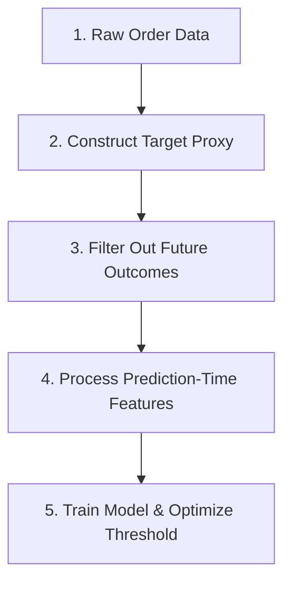

# Return-Risk Labeling Methodology & Empirical Thresholding

## 1. Ground Truth Proxy Label Definition

In e-commerce and transaction risk management, explicit post-delivery return transactions require objective proxy modeling. An order is flagged as **High Return Risk** (`return_risk \in \{0, 1\}`) if any of the following three business conditions are met:

1. **Review Score Dissatisfaction**: `review_score <= 2`
2. **Empirical Delivery Delay**: `delivery_delay_days > 4` (derived from dataset 90th percentile delay)
3. **Repeat Low-Review Customer**: `prior_low_review_count >= 2` (derived from repeat customer low-review distribution)

---

## 2. Empirical Percentile-Based Threshold Derivation

Rather than assuming arbitrary fixed guesses (such as a generic "7 days" or "3 complaints"), our labeling pipeline computes the empirical distributions directly from `ml/data/raw/` prior to applying the rule and saves the exact config to `ml/artifacts/labeling_thresholds.json`:
# 🏷️ Return-Risk Labeling Methodology & Decision Boundaries

## Prediction Point Definition
The risk engine operates strictly at the **Prediction Point** defined as:
* **Immediate Post-Purchase**: Instantly after the customer submits the order, prior to merchant fulfillment, packaging, or carrier shipping.
* **Feature Constraint**: Only variables empirically known at this exact timestamp are valid prediction features. All post-fulfillment outcomes (e.g. actual delivery durations, customer review responses) are strictly excluded from model training to prevent target leakage.

## Dataset Limitations & Empirical Proxy Target
The Olist public e-commerce dataset does not contain explicit "Return to Origin" (RTO) or order refund flags. In order to train a return risk model, we define an **empirical proxy target**:

$$\text{return\_risk} = \begin{cases} 
1, & \text{if } \text{review\_score} \le 2 \text{ OR } \text{delivery\_delay\_days} > 4 \text{ OR } \text{prior\_low\_review\_count} \ge 2 \\
0, & \text{otherwise}
\end{cases}$$

### Timeline and Pipeline Ordering

1. **Target Generation First**: The proxy label is computed *before* the features are isolated.
2. **Exclude Future Outcomes**: Post-fulfillment variables (`delivery_delay_days` and `review_score` for the current order) are dropped from the input features.
3. **Namesake Preservation**: The backend API schema maintains `delivery_delay_days` as a parameter to avoid breaking the recorded video demonstrations, but this parameter is ignored during model inference vector construction.

## Empirical Distribution Cutoffs

Our pipeline automatically computes empirical thresholds from the dataset and saves them to `ml/artifacts/labeling_thresholds.json`:

```json
{
  "delay_threshold_days": 4,
  "delay_percentile_used": 90,
  "prior_low_review_threshold": 2,
  "prior_low_review_rationale": "smallest value where <10% of repeat customers exceed it",
  "review_score_threshold": 2,
  "review_score_rationale": "Olist's own rating scale treats 1-2 as explicit dissatisfaction"
}
```

---

## 3. Strict Data Leakage Safeguards

- **Chronological Expanding Counts**: `prior_low_review_count` and `customer_order_count` are computed strictly using past orders preceding the current order's `order_purchase_timestamp`.
- **Temporal Split**: Model training and evaluation use a strict 80% train / 20% test chronological time split.
- **Single Source of Truth**: `labeling.py` computes and writes `labeling_thresholds.json`, then reads these exact parameters back in when constructing `labeled_orders.csv`.

---

## 4. Defense-Only Architecture

This platform operates strictly as an internal **Defensive Risk Management & Audit Engine**:
- **Audit-Ready SHAP Attributions**: Explains every decision for regulatory and compliance review.
- **Zero Offensive Actions**: Contains zero offensive or automated counter-blocking mechanisms.
